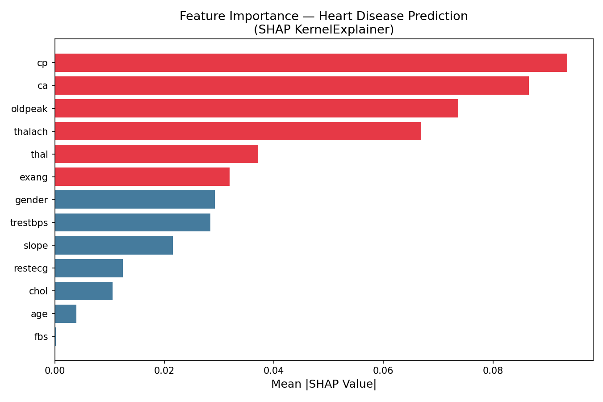

# Deliverable 2: Model Explainability — SHAP Analysis

## Method
We used **SHAP KernelExplainer** on a LogisticRegression model trained on the Cleveland Heart Disease dataset. SHAP (SHapley Additive exPlanations) assigns each feature an importance score reflecting its average contribution to the model's output.

## Full Feature Importance Ranking

| Rank | Feature | Mean |SHAP| |
|------|---------|-------------|
| 1 | `cp` | 0.0936 |
| 2 | `ca` | 0.0865 |
| 3 | `oldpeak` | 0.0736 |
| 4 | `thalach` | 0.0669 |
| 5 | `thal` | 0.0372 |
| 6 | `exang` | 0.0319 |
| 7 | `gender` | 0.0292 |
| 8 | `trestbps` | 0.0284 |
| 9 | `slope` | 0.0216 |
| 10 | `restecg` | 0.0124 |
| 11 | `chol` | 0.0106 |
| 12 | `age` | 0.0040 |
| 13 | `fbs` | 0.0002 |

## Least Impactful Features (Plain English)

Based on SHAP analysis, the features with the **least impact** on predicting heart disease are:

- **chol (Serum Cholesterol)** — Despite its clinical notoriety, serum cholesterol has a surprisingly low SHAP contribution in this dataset.
- **age** — This feature shows low mean absolute SHAP value, indicating it rarely changes the model prediction significantly.
- **fbs (Fasting Blood Sugar > 120 mg/dl)** — Whether a patient has elevated fasting blood sugar has very little influence on the model's prediction of heart disease.

## Key Insight

The **most impactful** features are those related to chest pain type (`cp`), number of major vessels (`ca`), thalassemia type (`thal`), max heart rate (`thalach`), and exercise-induced angina (`exang`). These directly reflect cardiac stress and structural heart conditions.

