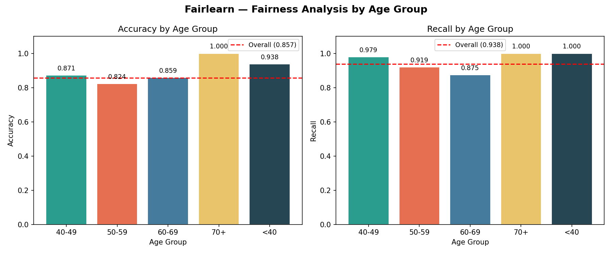

# Deliverable 3: Fairness Testing with Fairlearn

## Sensitive Attribute: Age (Binned)

Age was binned into five clinical groups: `<40`, `40-49`, `50-59`, `60-69`, `70+`.

## Overall Model Metrics

| Metric | Value |
|--------|-------|
| accuracy | 0.8567 |
| precision | 0.8242 |
| recall | 0.9375 |
| selection_rate | 0.6212 |

## Metrics by Age Group

| age_group   |   accuracy |   precision |   recall |   selection_rate |
|:------------|-----------:|------------:|---------:|-----------------:|
| 40-49       |   0.871429 |    0.854545 | 0.979167 |         0.785714 |
| 50-59       |   0.823529 |    0.780822 | 0.919355 |         0.613445 |
| 60-69       |   0.858974 |    0.8      | 0.875    |         0.448718 |
| 70+         |   1        |    1        | 1        |         0.6      |
| <40         |   0.9375   |    0.923077 | 1        |         0.8125   |

## Disparity Analysis

- **Max accuracy gap** across age groups: `0.1765`
- **Max recall gap** across age groups: `0.1250`

> ⚠️ **Significant accuracy disparity detected** (>10%). The model may be less reliable for certain age cohorts.

## Interpretation

Fairness testing with `fairlearn.metrics.MetricFrame` reveals how model performance varies across age groups. Elevated recall gaps may indicate the model misses heart disease cases in specific age bands, which is clinically significant.

